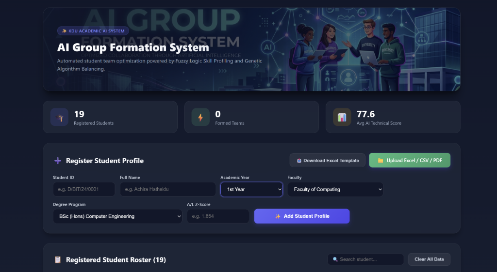

# 🎓 KDU AI Group Formation System

[](https://reactjs.org/)
[](https://vitejs.dev/)
[](https://www.oracle.com/java/)
[](https://supabase.com/)
[](#license)

An automated, intelligent student team optimization platform designed for **General Sir John Kotelawala Defence University (KDU)**. The system leverages **Fuzzy Logic Skill Profiling** and a **Genetic Algorithm Balancing Engine** to construct fair, balanced, and cross-disciplinary student teams.

---

## 📸 Dashboard Preview



---

## ✨ Key Features

- 🎨 **Modern Glassmorphic Dashboard**: Dark-themed UI with real-time student roster stats, avatar badges, and skill progress bars.
- 📁 **Multi-Format Bulk Data Upload (Excel, CSV, PDF)**:
  - In-browser parsing for `.xlsx`, `.xls`, `.csv`, and `.pdf` files.
  - Automatically extracts Student IDs, Full Names, Academic Years, and Scores using `pdfjs-dist` & `xlsx`.
- 🎓 **Dynamic Z-Score & GPA Support**:
  - **1st Year (1st Sem)**: Uses A/L Z-Score (0.0 - 3.5).
  - **2nd, 3rd & 4th Year**: Uses University GPA (0.0 - 4.0).
- 🛡️ **Duplicate Student ID Protection**: Automatic real-time validation and batch-import duplicate skipping to maintain clean data integrity.
- 🧠 **AI Genetic Algorithm Engine**: Optimizes skill distribution across teams while maximizing inter-disciplinary diversity.
- 📄 **PDF Report Generation**: Instant export of formatted team allocation reports for academic administration.

---

## 📂 Project Structure

```text
ai-group-formation/
├── frontend/                 # React 18 + Vite Web Application
│   ├── src/
│   │   ├── assets/           # UI Banners & Graphic Assets
│   │   ├── services/         # Supabase Client Configuration
│   │   └── App.jsx           # Main Dashboard & UI Components
│   └── package.json
│
├── backend/                  # Java 17+ AI Genetic Engine
│   ├── src/main/java/
│   │   ├── ai_engine/        # Genetic Optimization Algorithm
│   │   ├── models/           # Student Data Models
│   │   └── Main.java         # Execution Entrypoint
│   └── run-dev.js            # Node runner script for Java compilation
│
├── database/
│   └── supabase_schema.sql   # PostgreSQL Database Schema
│
└── docs/
    └── images/               # Repository Screenshots & Media
```

---

## 🚀 Getting Started

### Prerequisites
- **Node.js**: v18+ (Recommended v20/v24)
- **Java JDK**: 17+ (with `javac` and `java` added to PATH)

---

### 1. Running the Frontend (React + Vite)

```bash
# Navigate to the frontend directory
cd frontend

# Install dependencies
npm install

# Start the Vite development server
npm run dev
```

The application will launch locally at **`http://localhost:5173/`**.

---

### 2. Running the Backend (Java AI Engine)

```bash
# Navigate to the backend directory
cd backend

# Compile and run Java AI Engine
node run-dev.js
```

---

## 📊 Sample Data Upload Format

Lecturers can upload an Excel/CSV file with the following column headers:

| Student ID | Full Name | Academic Year | Faculty | Degree Program | Score |
| :--- | :--- | :--- | :--- | :--- | :--- |
| `D/BIT/24/0001` | Achira Hathsidu | `1st Year` | Faculty of Computing | BSc (Hons) Computer Science | `1.854` |
| `D/BIT/23/0045` | Kasun Perera | `2nd Year` | Faculty of Computing | BSc (Hons) Software Engineering | `3.75` |

---

## 🛠️ Built With

- **Frontend**: React 18, Vite, jsPDF, AutoTable, SheetJS (XLSX), PDF.js (`pdfjs-dist`)
- **Backend**: Java 17, Maven
- **Database**: Supabase (PostgreSQL)

---

## 👤 Author

Developed by **[Achira Hathsidu](https://github.com/Achira810)**

---

## 📜 License

This project is licensed under the MIT License.
