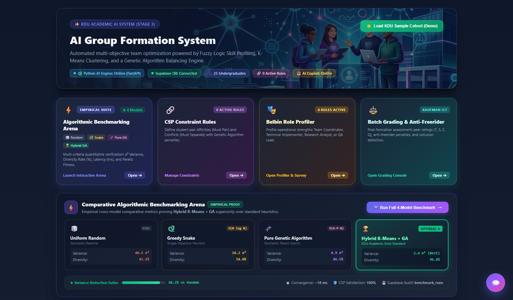
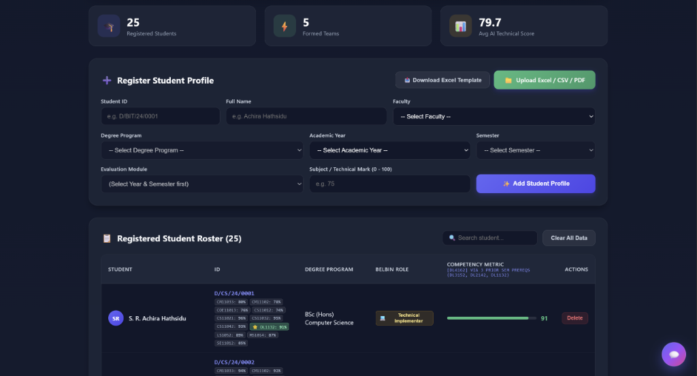
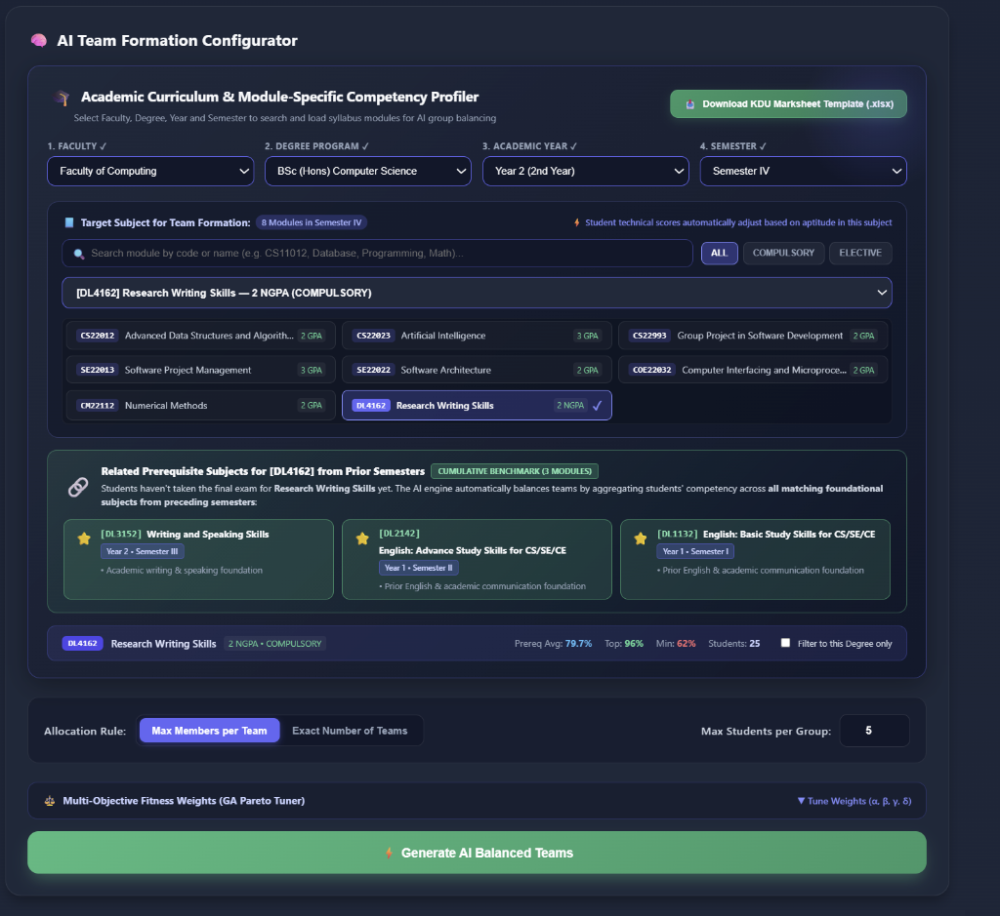
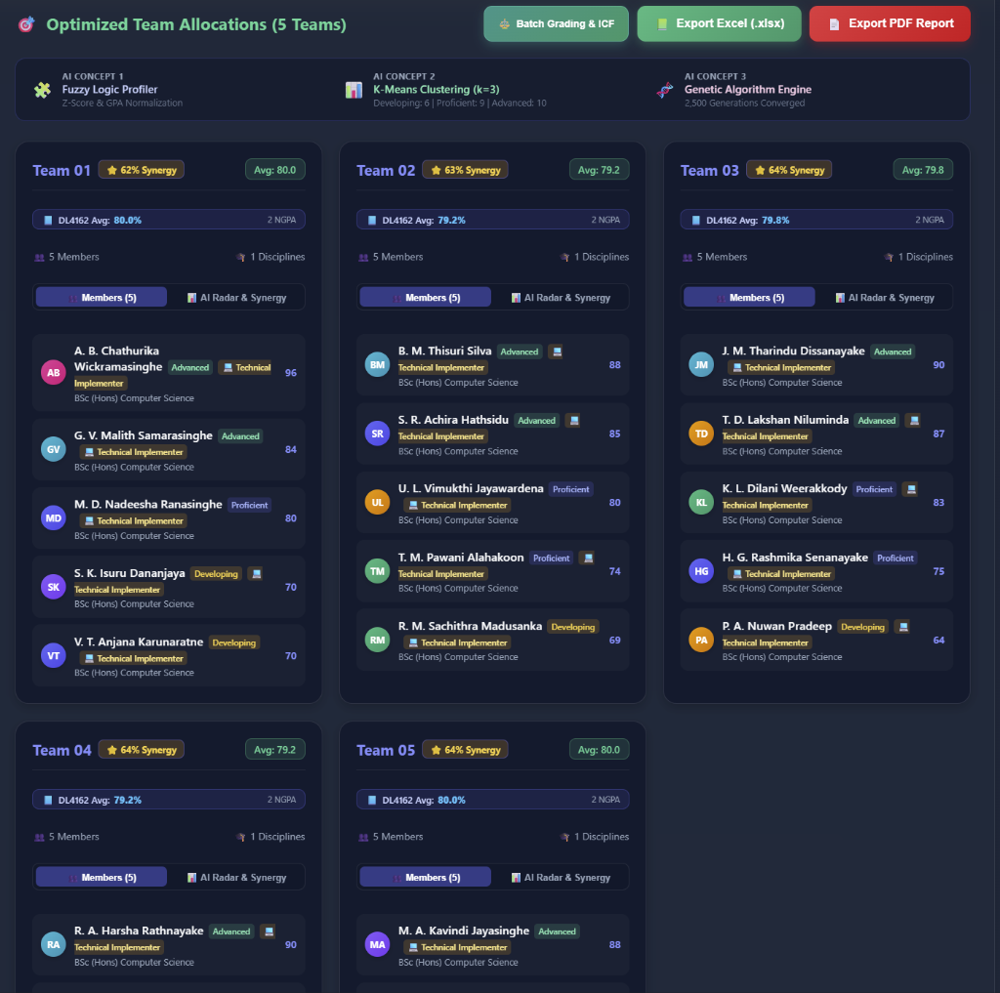

# 🎓 KDU AI Group Formation System

[](https://reactjs.org/)
[](https://vitejs.dev/)
[](https://www.oracle.com/java/)
[](https://supabase.com/)
[](https://ai-group-formation.vercel.app/)
[](#license)

An automated, intelligent student team optimization platform designed for **General Sir John Kotelawala Defence University (KDU)**. The system leverages a 3-stage hybrid AI pipeline—**Fuzzy Logic Skill Profiling**, **K-Means Cohort Stratification**, and a **Genetic Algorithm Balancing Engine**—to construct fair, balanced, and cross-disciplinary student teams.

🌐 **Live Deployment:** [https://ai-group-formation.vercel.app/](https://ai-group-formation.vercel.app/)

---

## 📸 Dashboard Previews

### 1. System Header, Empirical Suite & Benchmarking Arena


### 2. Student Registration & Roster with Real-Time Competency Metrics


### 3. Academic Curriculum & Module-Specific Competency Profiler


### 4. AI-Optimized Balanced Team Allocations & Synergy Scores


---

## ✨ Key Features

- 🎨 **Modern Glassmorphic Dashboard**: Dark-themed UI with real-time student roster stats, avatar badges, and skill progress bars.
- 📚 **KDU Curriculum & Module-Specific Profiling**:
  - Full official syllabus integration for KDU Computing degrees (**Computer Science**, **Information Technology**, **Information Systems**, **Data Science & Business Analytics**).
  - Evaluates student aptitude based on selected target modules and **cumulative prerequisite competency across all prior semesters**.
- 📁 **Multi-Format Bulk Data Upload (Excel, CSV, PDF)**:
  - In-browser parsing for `.xlsx`, `.xls`, `.csv`, and `.pdf` files.
  - Full native support for the official **KDU Examination Results Marksheet Format** (`Marks Format.xlsx`).
- 🎓 **Dynamic Z-Score & Direct Mark Evaluation**:
  - **1st Year (1st Sem)**: Direct school intake evaluated via A/L Z-Score baseline.
  - **Semesters 2 to 8**: Direct evaluation using subject marks (0 - 100%) and prerequisite cumulative performance.
- 🎭 **Belbin Team Role Profiler**: Assigns operational roles (Team Coordinator, Technical Implementer, Innovator, Specialist, QA Lead) to ensure functional team balance.
- 🔗 **CSP Constraint Satisfaction Engine**: Real-time enforcement of student pair Affinities (Must Pair) and Conflicts (Must Separate).
- 🧠 **3-Stage Hybrid AI Architecture**:
  - **Concept 1: Fuzzy Logic Profiler**: Standardizes disparate academic metrics into continuous competency scores.
  - **Concept 2: K-Means Clustering**: Partitions cohorts into $k=3$ stratified performance tiers (Developing, Proficient, Advanced) to eliminate homogeneous team seeding.
  - **Concept 3: Genetic Algorithm Optimizer**: Performs multi-objective optimization (2,500 iterations) balancing skill equity, role diversity, and constraint satisfaction.
- ⚡ **Empirical Benchmarking Suite**: 4-model comparative verification (Random, Greedy Snake, Pure GA, and Hybrid K-Means + GA).
- 📄 **Dual Report Generation**: Instant export of formatted team allocation reports in both **PDF** and **Excel (.xlsx)** formats.

---

## 📂 Project Structure

```text
ai-group-formation/
├── frontend/                 # React 18 + Vite Web Application
│   ├── src/
│   │   ├── assets/           # UI Banners & Graphic Assets
│   │   ├── services/         # Supabase Client Configuration
│   │   └── App.jsx           # Main Dashboard & UI Components
│   └── package.json
│
├── backend/                  # Java 17+ AI Genetic Engine
│   ├── src/main/java/
│   │   ├── ai_engine/        # Genetic Optimization Algorithm
│   │   ├── models/           # Student Data Models
│   │   └── Main.java         # Execution Entrypoint
│   └── run-dev.js            # Node runner script for Java compilation
│
├── database/
│   └── supabase_schema.sql   # PostgreSQL Database Schema
│
└── docs/
    └── images/               # Repository Screenshots & Media
```

---

## 🚀 Getting Started

### Prerequisites
- **Node.js**: v18+ (Recommended v20/v24)
- **Java JDK**: 17+ (with `javac` and `java` added to PATH)

---

### 1. Running the Frontend (React + Vite)

```bash
# Navigate to the frontend directory
cd frontend

# Install dependencies
npm install

# Start the Vite development server
npm run dev
```

The application will launch locally at **`http://localhost:5173/`**.

---

### 2. Running the Backend (Java AI Engine)

```bash
# Navigate to the backend directory
cd backend

# Compile and run Java AI Engine
node run-dev.js
```

---

## 📊 Sample Data Upload Format

Lecturers can upload an Excel/CSV file with the following column headers:

| Student ID | Full Name | Academic Year | Faculty | Degree Program | Score |
| :--- | :--- | :--- | :--- | :--- | :--- |
| `D/BIT/24/0001` | Achira Hathsidu | `1st Year` | Faculty of Computing | BSc (Hons) Computer Science | `1.854` |
| `D/DBA/25/0031` | D.L. Niluminda | `2nd Year` | Faculty of Computing | BSc (Hons) Data Science and Business Anelytics | `3.75` |

---

## 🛠️ Built With

- **Frontend**: React 18, Vite, jsPDF, AutoTable, SheetJS (XLSX), PDF.js (`pdfjs-dist`)
- **Backend**: Java 17, Maven
- **Database**: Supabase (PostgreSQL)

---

## 👥 Developers

Developed by:
- **[Achira Hathsidu](https://github.com/Achira810)**
- **Lasath**
- **Piravahiny**
- **Wageesha Muthugala**
- **Maheshika Banagala**

---

## 📜 License

This project is licensed under the MIT License.
